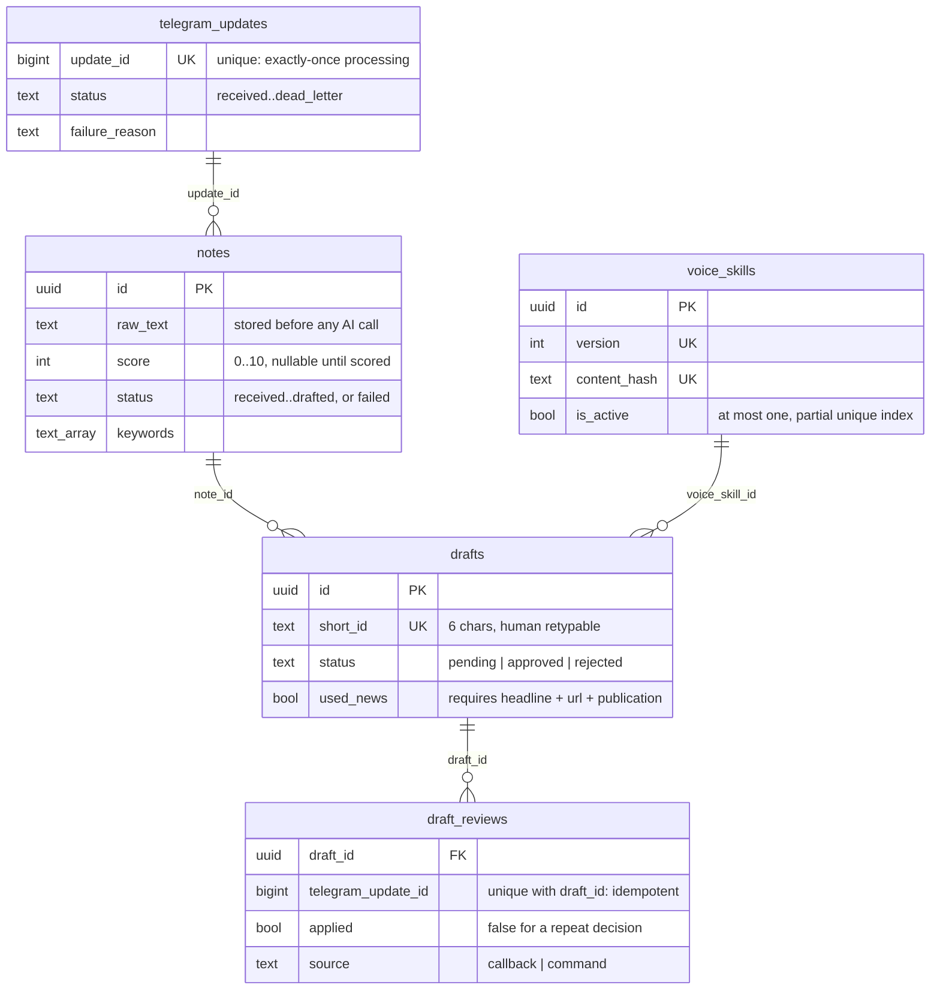

# Component map

How a note becomes a reviewed draft. The automation stops at the human review gate: nothing in this system can publish or schedule a LinkedIn post.

## Flow

```mermaid
flowchart TD
    subgraph TRIGGER["1. Trigger"]
        A["Meera posts a text note in her private Telegram channel"]
    end

    subgraph INPUT["2. Input"]
        B["Telegram sends a webhook to Vercel<br/>POST /api/telegram/webhook"]
        C{"Secret token valid?<br/>timing-safe compare"}
        D{"From TELEGRAM_ALLOWED_CHAT_ID?"}
        E{"update_id already claimed?"}
        F["Store the raw note in Supabase<br/>notes: text, chat, message, timestamp, status"]
    end

    subgraph AI_SCORE["3. Scoring"]
        G["Gemini scores the note 0 to 10<br/>strict JSON, validated with Zod"]
        H{"score >= 6 ?"}
        I["Save score and reason<br/>status = rejected_low_score"]
        J["Telegram reply: why no draft was written"]
    end

    subgraph CONTEXT["4. Context (optional)"]
        K["Validated keywords from the score"]
        L["news_cache hit?"]
        M["Google News RSS search<br/>headline, publication, date, url, RSS description"]
        N{"Gemini: is this result genuinely relevant?"}
        O["No news angle<br/>draft from the note alone"]
    end

    subgraph AI_DRAFT["5. Drafting"]
        P["Load the active versioned voice skill<br/>voice_skills.is_active"]
        Q["Gemini drafts in Meera's voice<br/>note + voice skill + optional verified source metadata"]
        R["Validate JSON, strip emoji and stray hashtags,<br/>discard any news claim we did not supply"]
    end

    subgraph OUTPUT["6. Output"]
        S["Store the draft as status = pending<br/>FK to note and to voice skill version"]
        T["Telegram message: draft id, score, body,<br/>NEWS SOURCE verification block, Approve / Reject buttons"]
    end

    subgraph GATE["7. Human review gate"]
        U["Meera reads, edits if needed, and decides"]
        V["Approve / Reject button, or APPROVE id / REJECT id"]
        W["record_draft_review: single transaction<br/>status change + audit row, idempotent"]
        X["Supabase stores the decision<br/>who, when, which Telegram update"]
    end

    subgraph OUTSIDE["Outside the automation"]
        Y["Meera copies an approved draft into LinkedIn herself"]
    end

    A --> B --> C
    C -- "no: 401" --> Z1["Rejected, nothing stored"]
    C -- yes --> D
    D -- "no: 403" --> Z1
    D -- yes --> E
    E -- "yes: 200 duplicate" --> Z2["No reprocessing"]
    E -- no --> F --> G --> H
    H -- no --> I --> J
    H -- yes --> K --> L
    L -- hit --> N
    L -- miss --> M --> N
    N -- no --> O
    N -- yes --> P
    O --> P
    P --> Q --> R --> S --> T --> U --> V --> W --> X
    X -.->|"manual, never automated"| Y

    classDef gate fill:#fff4e6,stroke:#d97706,stroke-width:2px
    classDef stop fill:#fee2e2,stroke:#dc2626
    classDef manual fill:#ecfdf5,stroke:#059669,stroke-dasharray: 5 5
    class U,V,W gate
    class Z1,Z2,I,J stop
    class Y manual
```

## The thirteen steps

| # | Step | Where it lives |
| --- | --- | --- |
| 1 | Meera posts a note in her private Telegram channel | Telegram |
| 2 | Telegram sends a webhook to Vercel | `src/app/api/telegram/webhook/route.ts` |
| 3 | The server validates, deduplicates, and stores the note in Supabase | `src/lib/webhook/handle.ts`, `claim_telegram_update`, `store_note` |
| 4 | Gemini scores the note | `src/lib/gemini/scoring.ts` |
| 5 | Notes below 6 stop and return a reason | `src/lib/pipeline/process-note.ts`, `buildRejectionMessage` |
| 6 | Qualifying notes generate keywords | `noteScoreSchema.keywords`, normalised to three to five terms |
| 7 | Google News RSS provides optional context | `src/lib/news/rss.ts`, cached in `news_cache` |
| 8 | Gemini receives the note, voice skill, and optional verified source metadata | `src/lib/gemini/drafting.ts` |
| 9 | The draft is stored as pending | `create_draft_for_note` |
| 10 | Telegram returns the draft | `src/lib/telegram/messages.ts`, `buildDraftMessage` |
| 11 | Meera approves or rejects it | Inline buttons or `APPROVE <id>` / `REJECT <id>` |
| 12 | Supabase stores the review decision | `record_draft_review`, `draft_reviews` |
| 13 | LinkedIn publication stays outside the automation | No LinkedIn credential exists in this system |

## Data model

## Failure behaviour

| Failure | Behaviour |
| --- | --- |
| Wrong or missing webhook secret | 401, nothing stored, nothing logged beyond the rejection |
| Chat is not the allowed chat | 403, nothing stored |
| Malformed payload | 400, nothing stored |
| Duplicate `update_id` | 200 with `duplicate: true`, no reprocessing |
| Per-chat rate limit exceeded | 200, update marked `rate_limited`, one short Telegram notice |
| Container at concurrency limit | 429 so Telegram retries later, before the update is claimed |
| Gemini transient failure | Up to 3 attempts with exponential backoff and jitter |
| Gemini auth or bad-request failure | No retry, update goes to `dead_letter` |
| RSS slow, failing, or irrelevant | Draft is written from the note alone |
| Any unrecoverable pipeline error | Note kept with `status = failed`, update `dead_letter`, user-safe Telegram message with a request id |
